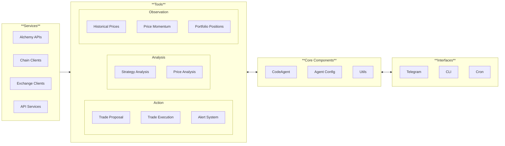

# AlphaSwarm Architecture

## Introduction

AlphaSwarm is currently built with the [smolagents](https://github.com/huggingface/smolagents) framework. AlphaSwarm adds value on top of this in the form of customizable services, tools, and agent configurations geared for trading.

### About `CodeAgent`

AlphaSwarm agents are currently based on the `CodeAgent` from `smolagents`. AlphaSwarm additionally provides specialized tools and configurations for crypto trading. The key benefit of adopting the `CodeAgent` has to do with the way it uses tools:

- Instead of using structured JSON for tool invocation (the industry standard), agents generate and execute Python code directly
- This Python-based approach enables greater flexibility - agents can write additional code before/after tool invocations
- Evidence suggests that planning in code (vs. JSON tool sequences) leads to more accurate execution on the first attempt

For code execution, we are currently relying on smolagents' [local Python code execution](https://huggingface.co/docs/smolagents/v1.6.0/en/tutorials/secure_code_execution#local-python-interpreter) framework. Secured, remote execution is part of the roadmap.

## Version Support (Initially Planned)

- Uniswap: V2 and V3 protocols
- Chains: Ethereum, Base, Solana
- Test Networks: Ethereum Sepolia

### Agent Creation Example

Here's a simple example showing the core components of an AlphaSwarm agent:

```python
from alphaswarm.agent import AlphaSwarmAgent
from alphaswarm.tools import PriceTool, TradeExecutionTool


# 1. Initialize tools
tools = [
    PriceTool(),              # For price data access
    TradeExecutionTool()      # For trade execution
]

# 2. Create the agent
agent = AlphaSwarmAgent(
    tools=tools,
    model_id="anthropic/claude-3-5-sonnet-latest"
    system_prompt="path/to/custom/prompt.txt"  # Coming soon
)

# 3. Interact with the agent
async def example():
    response = await agent.process_message("What's the current price of ETH?")
```

The agent is defined by:
1. A set of tools (for accessing data, executing trades, etc.)
2. Any necessary configuration (like API keys)
3. A system prompt (currently using smolagents default)

> **Coming Soon**: A reference system prompt file will be included in the repository. This will serve as a base template for creating custom system prompts, allowing you to modify the agent's core behavior while maintaining compatibility with the smolagents framework.

## Tool Interfaces

All tools in AlphaSwarm extend the smolagents `Tool` base class which requires:

```python
from smolagents import Tool


class MyTool(Tool):
    name: str            # Name used to reference the tool
    description: str     # Description of functionality
    inputs: Dict[str, Dict[str, <input schema>]  # See below for input schema
    output_type: str     # Output type from authorized types
    
    # Required method
    def forward(self, *args, **kwargs):
        pass  # Core tool implementation
```

The `inputs` dictionary must specify the schema for each input parameter:
```python
inputs = {
    "param_name": {
        "type": str,        # Must be one of AUTHORIZED_TYPES
        "description": str, # Agent-readable description
        "nullable": bool,   # Optional, if parameter can be None
        "default": ...,     # A literal value of the parameter's type
    }
}
```

Authorized types are: string, boolean, integer, number, image, audio, array, object, any, null.

Tools can be created either by:
1. Subclassing the `Tool` class and implementing the required attributes/methods (preferred)
2. Using the `@tool` decorator on a function with proper type hints and docstrings

Please review [tools docs](https://huggingface.co/docs/smolagents/tutorials/tools) from `smolagents` for more details.

## Security

- Private keys and API credentials must be handled via environment variables
- Code execution is sandboxed via `smolagents`
- See SECURITY.md for vulnerability reporting procedures

## Architecture Overview



The architecture consists of three main components:

1. **Observation Layer** - Tools and services for data collection and monitoring
2. **Cognitive Layer** - Strategy analysis and decision making
3. **Action Layer** - Trade execution and notifications

### Core Components

#### Tools
Tools define interfaces for how the agent interacts with services and certain interface functions. A tool can be:
- A thin wrapper around a service (e.g., AlchemyPriceHistory)
- A composite tool combining multiple services
- A standalone implementation (e.g., PriceTool)

#### Services
Services contain the core implementation logic decoupled from any specific tool:
- API clients (e.g., AlchemyClient)
- Chain interfaces (e.g., Web3Client) - *moving soon*
- Exchange interfaces (e.g., UniswapClient) - *moving soon*

#### Interfaces
*Possible* interfaces for interacting with the agent:
- CLI
- Telegram
- Infinity Studio
- Cron Runner

### Current Directory Structure

```
alphaswarm/
├── agent/           # Agent implementation
├── core/            # Core framework components
├── tools/           # Tool definitions
│   ├── alchemy/     # Alchemy-specific tools
│   ├── strategy_analysis/  # Strategy analysis tools
│   ├── exchanges/   # Exchange-specific tools
│   └── price_tool.py
├── services/        # Service implementations
│   ├── alchemy/     # Alchemy API client
│   ├── chains/      # Blockchain clients
│   │   ├── base.py  # Base chain interface
│   │   ├── factory.py  # Chain client factory
│   │   ├── evm.py   # EVM chain implementation
│   │   └── sol.py   # Solana implementation
│   └── exchanges/   # Exchange clients
│       ├── base.py  # Base exchange interface
│       ├── factory.py  # Exchange client factory
│       ├── jupiter/  # Jupiter DEX implementation
│       └── uniswap/ # Uniswap implementation
├── utils/           # Utility functions and helpers
└── config.py        # Configuration management
```

## Future Evolution: Integration with Theoriq Protocol

AlphaSwarm could potentially evolve from a standalone agent framework into a key component of the Theoriq protocol ecosystem. The core evolution will involve moving from single agents to a distributed, specialized multi-agent architecture:

### Distributed Agent Architecture

Instead of having individual agents handle all responsibilities, functionality will be distributed across specialized agent types:

1. **Observer Agents**: Monitor data and emit messages when specific criteria are met
2. **Cognitive Agents**: Process messages from Observer Agents and generate trading decisions
3. **Action Agents**: Execute intents generated by Cognitive Agents, optimizing execution across venues

This transition would allow for greater specialization and efficiency, with agents focusing on specific tasks rather than handling everything locally. Initially, AlphaSwarm could maintain a simpler architecture where these functions are implemented as tools within single agents, but the framework is designed with this future evolution in mind.