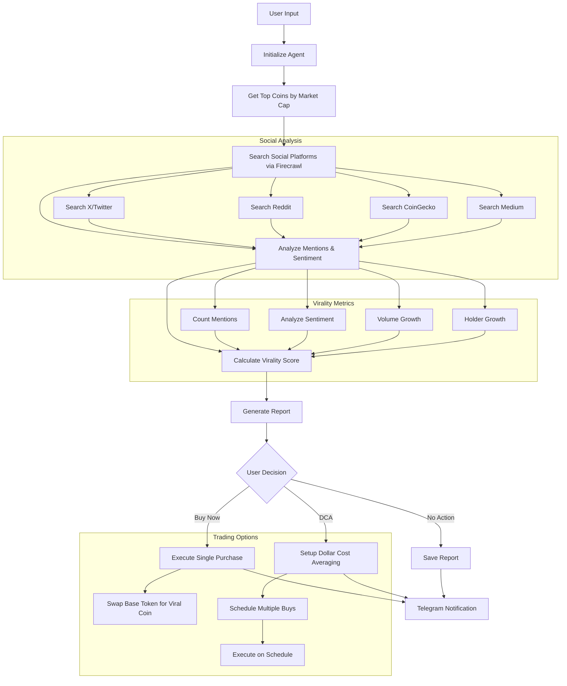

# Viral Coin Agent

The Viral Coin Agent is an AI-powered agent that finds the most viral cryptocurrencies based on social metrics and allows trading. It uses Firecrawl to search for mentions of coins on social media platforms, analyzes the results to identify the most viral coins, and allows trading based on user-defined parameters.

## How It Works



## Features

- **Social Media Analysis**: Uses Firecrawl to search for mentions of cryptocurrencies on social platforms like X (Twitter), Reddit, CoinGecko forums, and more
- **Virality Metrics**: Analyzes mentions, sentiment, volume growth, holder growth, and other metrics to calculate a virality score
- **Automated Trading**: Allows buying the most viral coins with a single command
- **Dollar Cost Averaging (DCA)**: Supports setting up DCA buys for viral coins
- **Telegram Integration**: Provides a Telegram bot interface for easy interaction
- **Scheduled Tasks**: Can run on a schedule to continuously monitor and trade viral coins

## Installation

1. Make sure you have Poetry installed:

```bash
curl -sSL https://install.python-poetry.org | python3 -
```

2. Install the dependencies:

```bash
poetry install
```

3. Set up your environment variables in `.env` file:

```
# API Keys
FIRECRAWL_API_KEY=your_firecrawl_api_key
ANTHROPIC_API_KEY=your_anthropic_api_key
OPENAI_API_KEY=your_openai_api_key

# Blockchain RPC URLs
ETH_RPC_URL=https://eth.llamarpc.com
ETH_SEPOLIA_RPC_URL=https://sepolia.drpc.org
BASE_RPC_URL=https://mainnet.base.org

# Wallet Configuration
ETH_WALLET_ADDRESS=your_ethereum_wallet_address
ETH_SEPOLIA_WALLET_ADDRESS=your_sepolia_wallet_address
ETH_PRIVATE_KEY=your_ethereum_private_key
ETH_SEPOLIA_PRIVATE_KEY=your_sepolia_private_key

# Telegram Configuration
TELEGRAM_BOT_TOKEN=your_telegram_bot_token
TELEGRAM_CHAT_ID=your_telegram_chat_id
```

## Usage

### Command-Line Interface

You can use the Viral Coin Agent from the command line:

```bash
# Run a one-time search for viral coins
poetry run python examples/viral_coin/viral_coin_agent_cli.py --chain ethereum_sepolia --min-market-cap 1000000 --max-age-days 30 --search-depth 50 --top-n 10

# Run a search and buy the top viral coin
poetry run python examples/viral_coin/viral_coin_agent_cli.py --chain ethereum_sepolia --buy --buy-amount 0.001

# Run a search and set up DCA buys for the top viral coin
poetry run python examples/viral_coin/viral_coin_agent_cli.py --chain ethereum_sepolia --dca --dca-amount 0.01 --dca-intervals 7 --dca-interval-hours 24

# Run a search and send the report to Telegram
poetry run python examples/viral_coin/viral_coin_agent_cli.py --chain ethereum_sepolia --telegram
```

### Scheduled Task

You can run the Viral Coin Agent as a scheduled task:

```bash
# Run the agent every 24 hours
poetry run python examples/viral_coin/viral_coin_agent_cron.py --chain ethereum_sepolia --interval-hours 24 --telegram

# Run the agent every 24 hours and buy the top viral coin
poetry run python examples/viral_coin/viral_coin_agent_cron.py --chain ethereum_sepolia --interval-hours 24 --buy --buy-amount 0.001 --telegram
```

### Telegram Bot

You can run the Viral Coin Agent as a Telegram bot:

```bash
# Start the Telegram bot
poetry run python examples/viral_coin/viral_coin_agent_telegram.py
```

Once the bot is running, you can interact with it using the following commands:

- `/start` - Start a new search for viral coins
- `/report` - Generate a report of the last search results
- `/buy` - Buy the top viral coin from the last search
- `/dca` - Set up DCA buys for the top viral coin
- `/help` - Show help message
- `/cancel` - Cancel the current operation

## Configuration

The Viral Coin Agent can be configured using the `config/viral_coin_agent.yaml` file. This file contains settings for:

- Search parameters (minimum market cap, maximum age, etc.)
- Virality metrics (platforms to search, weights for different metrics, etc.)
- Firecrawl settings (search depth, formats, etc.)
- Trading settings (networks, DCA settings, risk management, etc.)
- Reporting settings (Telegram, file reports, etc.)

## Examples

### Finding Viral Coins

```python
from alphaswarm.agents.viral_coin.viral_coin_agent import ViralCoinAgent

# Initialize the agent
agent = ViralCoinAgent(
    model_id="claude-3-7-sonnet",
    chain="ethereum_sepolia",
    min_market_cap=1000000,
    max_age_days=30,
    top_coins_limit=10,
    search_depth=50,
)

# Find viral coins
viral_coins = await agent.find_viral_coins()

# Generate report
report = await agent.generate_report(viral_coins)
print(report)
```

### Buying a Viral Coin

```python
# Buy the top viral coin
result = await agent.buy_viral_coin(
    coin_address=viral_coins[0].address,
    amount="0.001",
    slippage_percent=2.0,
)
print(f"Buy result: {result}")
```

### Setting Up DCA Buys

```python
# Set up DCA buys
dca_result = await agent.setup_dca_buys(
    coin_address=viral_coins[0].address,
    total_amount="0.01",
    num_intervals=7,
    interval_hours=24,
    slippage_percent=2.0,
)
print(f"DCA setup result: {dca_result}")
```

## License

This project is licensed under the terms of the LICENSE file included in the repository. 